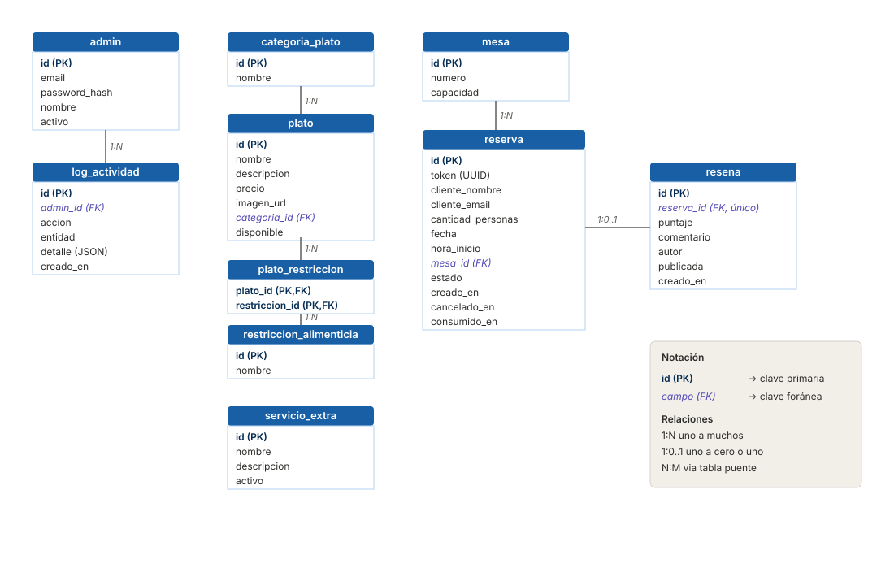
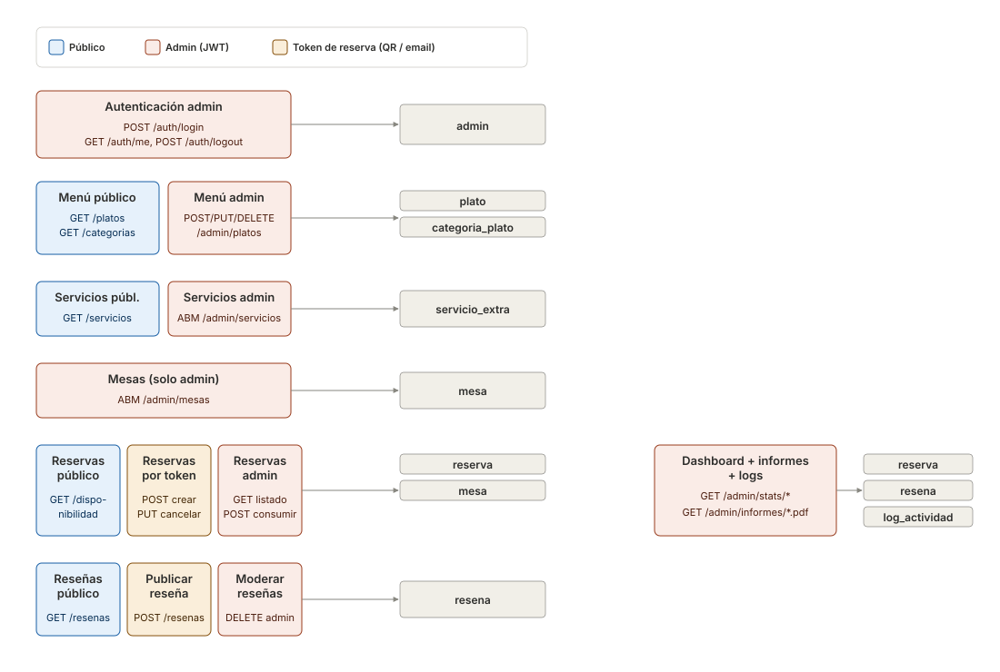

# Arquitectura — Crusty Crab

**Grupo 20 — en_mi_compu_andaba**

Este documento describe el modelo de datos y la organización de los endpoints REST del proyecto. Acompaña a [`schema.sql`](./schema.sql) y [`endpoints.md`](./endpoints.md).

---

## 1. Modelo de datos

  

### Notas de diseño

- **`plato_restriccion`** modela la relación N:M entre platos y restricciones alimenticias. Un plato puede ser vegetariano *y* sin TACC; una restricción aplica a muchos platos.
- **`servicio_extra`** no se relaciona con otras tablas: es un catálogo independiente que se muestra en la landing.
- **El estado `expirada` no se persiste** en la columna `estado` de `reserva`. Se calcula al vuelo cuando se consulta: `estado='confirmada' AND fecha < CURDATE()`.
- **`cancelado_en` y `consumido_en`** permiten estadísticas finas en el dashboard (cancelaciones por período, etc.) además del estado actual.
- **`log_actividad`** registra acciones de admins para auditoría. El campo `detalle` es JSON para guardar contexto variable según la acción.
- Hay un **índice único** sobre `(mesa_id, fecha, hora_inicio, estado)` que evita por base de datos que dos reservas confirmadas pisen la misma mesa en el mismo slot.

---

## 2. Endpoints por dominio

  

### Convenciones de seguridad

- **Público** (azul): sin autenticación. Frontend de la landing — menú, servicios, reseñas publicadas.
- **Admin** (rojo/coral): requiere JWT del administrador logueado. Todo lo que empieza con `/api/admin/*`.
- **Token de reserva** (ámbar): el `token` UUID generado al crear la reserva oficia de credencial. Va en el QR y en los links del email. Permite al cliente cancelar la reserva o publicar una reseña sin necesidad de registrarse.

### Notas sobre el diagrama

- Las flechas muestran la tabla "principal" que toca cada grupo de endpoints. Algunos endpoints tocan más de una tabla (ej. `POST /api/reservas` lee `mesa` para asignar y escribe en `reserva`).
- **`log_actividad`** se escribe como side-effect de casi todos los endpoints admin, no sólo desde el dashboard. En la implementación va a ser un decorador o middleware aplicado a todas las acciones autenticadas.
- **Dashboard e informes** leen de varias tablas (`reserva`, `resena`, `log_actividad`). El diagrama simplifica esto agrupándolos.

---

## 3. Resumen

| Capa | Componente | Cantidad |
|------|------------|----------|
| Datos | Tablas SQL | 10 |
| Datos | Relaciones | 6 directas + 1 N:M vía tabla puente |
| API  | Grupos de endpoints | 13 |
| API  | Modos de autenticación | 3 (público / admin JWT / token de reserva) |

Para el detalle completo de cada endpoint (verbo, path, payload, respuesta), ver [`endpoints.md`](./endpoints.md).
Para el script de creación de tablas y seed de prueba, ver [`schema.sql`](./schema.sql).
